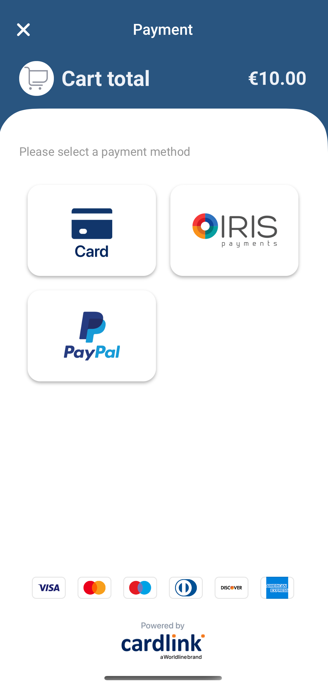
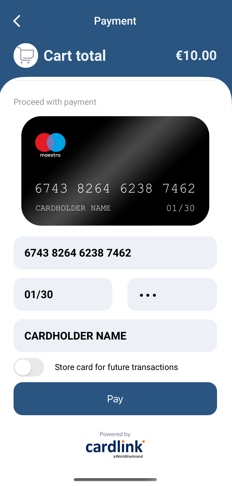
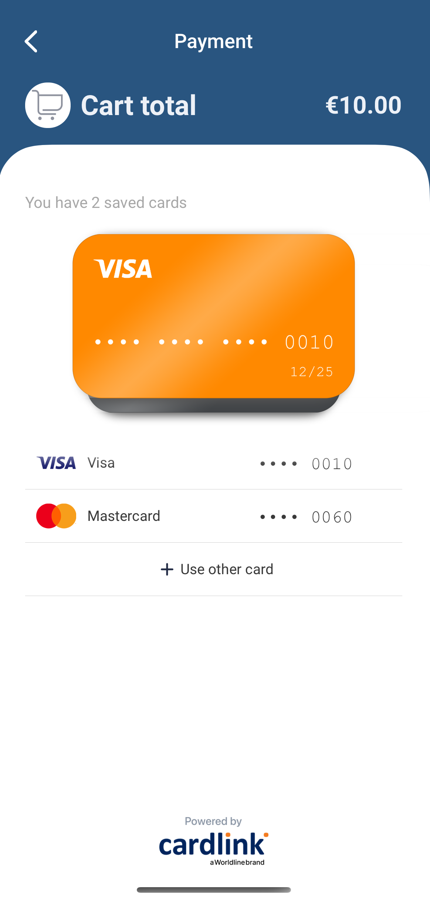

# Cardlink iOS Payments SDK

<p align="center"></p>

## Introduction

The Cardlink iOS Payments SDK is a comprehensive, easy-to-integrate solution specifically designed for eCommerce
applications on the iOS platform. This powerful SDK enables seamless processing of payments through various methods,
such as Credit Cards, IRIS Online Payments, and PayPal. It aims to provide your customers with a smooth and secure
transaction experience, while also offering developers a straightforward integration process.

<p align="center">&nbsp;&nbsp;&nbsp;&nbsp;&nbsp;&nbsp;&nbsp;&nbsp;</p>

## Features

- **Seamless Payment Processing:** Effortlessly handle transactions through a variety of payment options, including
  Credit
  Cards, IRIS Online Payments, and PayPal, ensuring an all-encompassing payment solution for your eCommerce application.

- **Secure Storage:** The Cardlink iOS SDK allows users to securely store their credit card information on the protected
  Cardlink servers, enabling seamless reuse without the need for re-entering card details multiple times.

- **Enhanced Security:** With the Cardlink iOS SDK, users' card data is never stored on their devices, and encrypted
  card information is transmitted to the server only once. This approach significantly heightens the security measures
  in place, safeguarding sensitive information.

- **Optimized User Experience:** By providing secure storage and seamless payment processing, the SDK ensures an
  improved
  user experience that minimizes friction during transactions and promotes customer satisfaction.

- **Straightforward Integration:** Designed with developers in mind, the Cardlink iOS Payments SDK offers a simple and
  efficient integration process, allowing you to quickly incorporate its features into your eCommerce application.

The **Cardlink iOS SDK** enables users to conveniently store their credit cards on secure Cardlink servers, allowing for
seamless reuse without re-entering card information multiple times. As the cards are never retained on the user's device
and encrypted card data is transmitted to the server only once, the SDK delivers heightened security while
simultaneously enhancing user experience.

Read on for more details on the integration process and sample code to get you started with the Cardlink iOS Payments
SDK. We look forward to making your eCommerce application more powerful, secure, and user-friendly!

## Requirements

- XCode 14 and iOS SDK 16
- iOS 9+ minimum deployment target
- All architectures

## Installation

### CocoaPods

To install CardlinkPaymentsSDK using CocoaPods, add the following line to your Podfile:

```ruby
pod 'CardlinkPaymentsSDK'
```

Then, run `pod install`.

### Swift Package Manager

To install CardlinkPaymentsSDK using Swift Package Manager, in Xcode select File > Swift Packages > Add Package
Dependency and enter:

`https://github.com/Cardlink-SA/cardlink-payments-ios-sdk`

## Usage

Follow these steps to start processing payments with Cardlink iOS Payments SDK:

1. Import the SDK into your code:

```swift
import CardlinkPaymentsSDK
```

2. Initialize the SDK with your merchant server URL:

```swift
let serverURL = URL(string: "https://yourserverurl.com")!
let cardlinkSDK = CardlinkSDK(serverURL: serverURL)
```

3. Set the SDK delegate to observe successful payments:

```swift
class PaymentDelegateClass: CardlinkSDKDelegate {
    func paymentCompleted(_ transaction: Transaction) {
        print("Transaction successful. Order id: \(transaction.orderId)")
    }
}

let paymentDelegateInstance = PaymentDelegateClass()
cardlinkSDK.delegate = paymentDelegateInstance
```

4. Initiate a payment by providing the required details:

```swift
cardlinkSDK.makePayment(
    present: hostViewController,
    amount: 100, // for example, 100 cents for a €1.00 charge
    description: "Your payment description",
    TDS2CardHolderName: "John Doe",
    TDS2BillAddrCity: "Athens",
    TDS2BillAddrLine1: "123 Street Name",
    TDS2BillAddrPostCode: "10001"
)
```

### Specifying currency amounts

Currency amounts should be provided via the `amount` parameter as positive integers, representing how much to charge in
the smallest currency unit (e.g., 100 cents to charge €1.00, or 50050 cents to charge €500.50).

### The `Transaction` struct

A `Transaction` object is returned for every successful payment by
the `paymentCompleted(_ transaction: Transaction)` delegate method of `CardlinkSDKDelegate`. It contains basic
information about the completed payment transaction.

#### `orderId`

A unique String identifier of the order associated with this transaction. This value is generated by the system.

#### `amount`

The payment amount for the transaction, represented as a string (`"100"` means
€1.00 - [see Specifying currency amounts](#specifying-currency-amounts))

#### `currency`

The three-letter currency code (ISO 4217) of the transaction, such as "EUR" for Euros or "USD" for US Dollars.

#### `description`

A brief description of the transaction, which can be useful for providing additional context.

### Example

The repository includes [an Example App](/ExampleApp) that enables users to make payments and observe how the SDK
operates within a live application.

## License

Cardlink iOS Payments SDK is released under the MIT
license. [See LICENSE](/LICENSE.md) for details.
